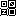

# c64char
`c64char` converts raster images into Commodore 64 8x8 character data, ready for inclusion in 6502 assembly source.

This CLI tool was built to conveniently put together custom character data for use in C64 assembly source code. It
behaves like a simple Unix-like filter: provide an image, receive assembler-ready character data, making it easy to
integrate into a build pipeline and to create custom character data.

The character ROM/RAM on a Commodore 64 is organized in 8x8 pixel blocks. Each block is composed of 8 bytes which
represent rows of pixels and each bit of a single byte represents the pixels on that specific row. When a bit is 1, the
selected foreground color for that tile will be used to draw the pixel on screen. The background color will be used in
the case the bit is 0.

For example, the following character:

```
.######.
#......#
#..##..#
#..##..#
#..##..#
#..##..#
#......#
.######.
```

would produce the following bits and bytes:
```
bits: 01111110 10000001 10011001 10011001 10011001 10011001 10000001 01111110

bytes: 7E 81 99 99 99 99 81 7E
```

## Installation

The only requirement is Go 1.26. Run the following command in your shell:

```bash
go install github.com/rebay1982/c64char@latest
```

## Usage

Simply specify the filename using the `-f` flag and `c64char` will output the conversion to the console.
```
c64char -f <filename>
```

You can also redirect STDOUT to a file to leverage it in a development pipeline.
```
c64char -f <filename> > <output_file>.asm
```

See the `-help` flag for all the possible flags.

```
$ c64char -help
Usage of c64char:
  -f string
    	Image filename.
```

## Input

The tool expects images in the following specifications:
 - JPEG or PNG;
 - dimensions divisible by 8;

Image dimensions have to be divisible by 8 because every 8x8 region of the raster image becomes one C64 character.

### Pixel Interpretation

Pixels are interpreted as being set when their value (either red, green, or blue components) is set to anything above
zero. Alpha channels from the source image file are completely ignored.

**NOTE**: Usage of JPEG is usually fine, but compression artifacts can cause pixels to be detected as "set". PNG would
ge the preferred format.

### Source document traversal order

For an image, the traversal order is as follows when generating the character blocks:

```
+---+---+---+
| 0 | 1 | 2 |
+---+---+---+
| 3 | 4 | 5 |
+---+---+---+
```

So, left-to-right, top-to-bottom. In the generated file, the "CHAR 0" will be the top left from the image file. "CHAR 1"
will be the one to its right if the image is wider than 8 pixels, etc.

## Output

The tool outputs a format that is compatible with the [ACME](https://sourceforge.net/projects/acme-crossass/) assembler.
Why? that's simply what I use. The code is extensible to allow other formats for other assemblers to be produced when/if
the need comes up.

### Example

The following input image would produce the following output:



```
; CHAR 0
!byte %11111111
!byte %10000001
!byte %10111101
!byte %10100101
!byte %10100101
!byte %10111101
!byte %10000001
!byte %11111111

; CHAR 1
!byte %00000000
!byte %01111110
!byte %01100010
!byte %01010010
!byte %01001010
!byte %01000110
!byte %01111110
!byte %00000000

; CHAR 2
!byte %01111110
!byte %10000001
!byte %10111101
!byte %10001001
!byte %10010001
!byte %10111101
!byte %10000001
!byte %01111110

; CHAR 3
!byte %10000001
!byte %01111110
!byte %01000010
!byte %01000010
!byte %01000010
!byte %01000010
!byte %01111110
!byte %10000001

```
